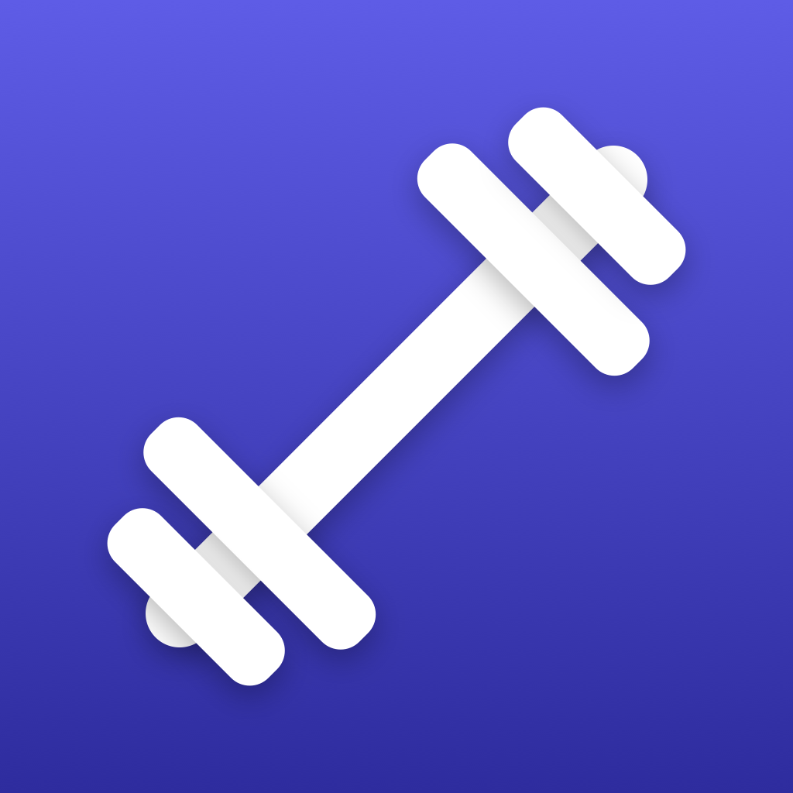
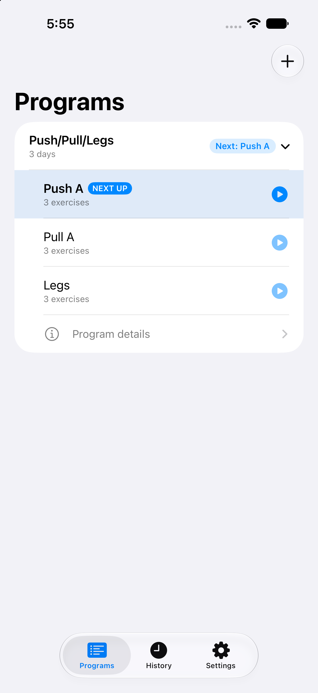
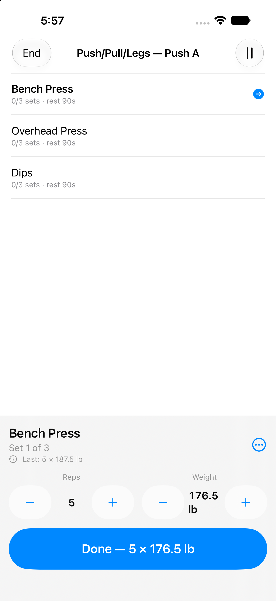
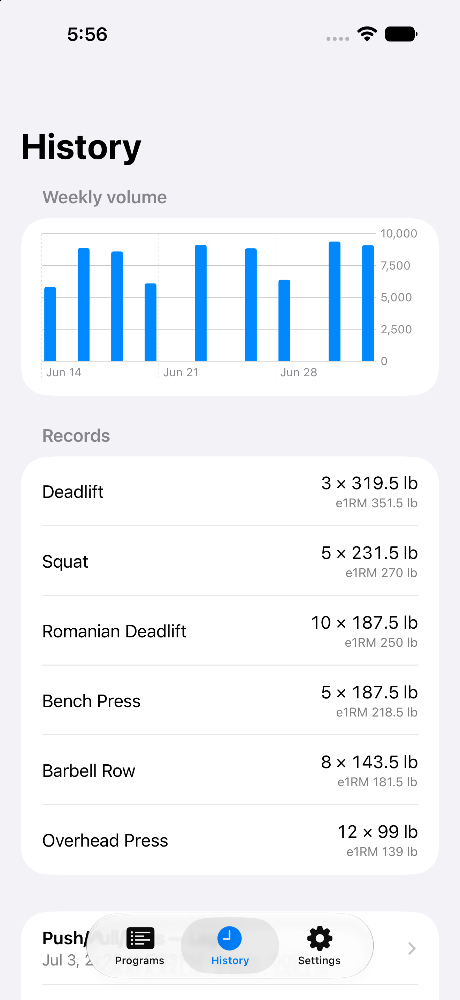
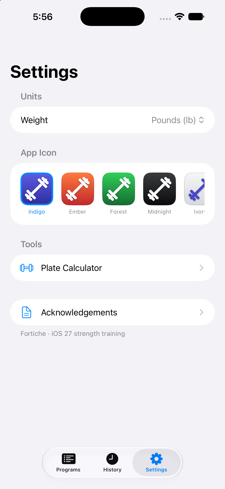
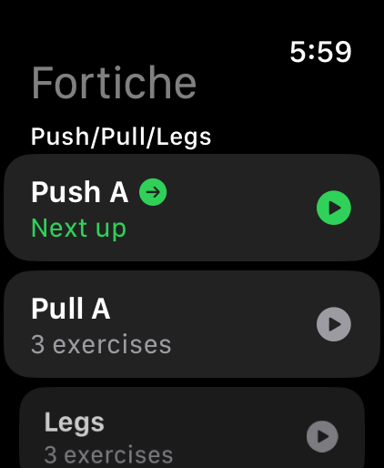
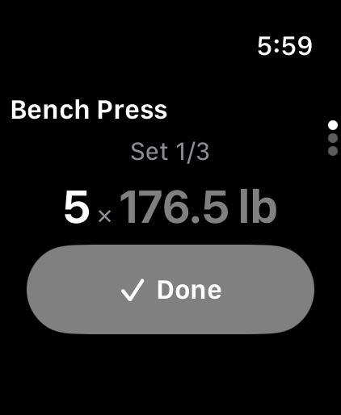

<p align="center">
  
</p>

# Fortiche

Hi, I'm David. I'm a software engineer that loves to workout. I've used
Anthropic Fable to build me the perfect workout app and I'm very pleased with
the results. The app is extensively using iOS 27 APIs so will be available
(for free) in September upon the new OS releases.

A strength-training app for iPhone and Apple Watch, built exclusively on the
iOS 27 / watchOS 27 SDKs. Paste any workout program as plain text and on-device
Apple Intelligence turns it into a structured, trackable plan.

> "Fortiche" is French slang for someone who's really good at something.

<p align="center">
  
  
  
  
</p>
<p align="center">
  
  &nbsp;&nbsp;
  
</p>

## Features

- **Text → program**: paste a program in any reasonable format ("Bench 3x5 @ 80kg",
  rep ranges, AMRAP, %1RM, RPE, rest times). Parsed on-device with the
  FoundationModels framework — nothing leaves the phone. A deterministic parser
  covers devices without Apple Intelligence.
- **Live workouts on either device**: full iPhone-only mode, or a watch-run
  session with heart rate. During watch workouts the phone shows a live,
  editable mirror — change weight/reps/sets from whichever device is closer.
- **Built for sweaty hands**: one giant action per screen, Digital Crown weight
  adjustment, Double Tap to complete a set, no fiddly gestures.
- **Rest timer** with watch haptics, phone notifications, and a Live Activity
  countdown in the Dynamic Island.
- **Live Activity** with interactive Done Set / Skip Rest / Pause buttons.
- **Apple Health**: workouts save with one `HKWorkoutActivity` per exercise;
  they count toward your rings.
- **Siri / App Intents**: "Start my push day", "Log 8 reps at 80 kilos",
  "Skip my rest" — hands-free while lifting.
- **History**: personal records (estimated 1RM), weekly volume chart,
  last-session ghost while lifting, plate calculator, kg/lb.

## Architecture

| Piece | Role |
|---|---|
| `FortichePack/` | Shared SwiftPM package: SwiftData models, the workout engine, parsing, sync protocol, stats, App Intents |
| `Fortiche/` | iOS app |
| `ForticheWatch/` | watchOS app |
| `ForticheWidgets/` | Live Activity + widgets |

Key design decisions:

- **Command-sourced workout engine** (`ActiveWorkoutEngine`): every mutation is
  a sequence-numbered command. The watch is authoritative during watch
  sessions; the phone applies edits optimistically and reconciles against
  echoed snapshots. State journals to disk on every command, so a crash
  restores mid-set.
- **Transports**: live sync rides `HKWorkoutSession` mirroring on real
  devices, with a WatchConnectivity fallback for simulators (mirroring's
  Rapport link doesn't exist between paired simulators — see
  `docs/SPIKE-M1.5.md`). Templates push phone → watch via
  `applicationContext`; finished workouts return dual-channel and upsert by
  UUID.
- **Weights are always stored in kilograms**; `WeightUnit` converts only at
  display/input boundaries.
- **CloudKit-ready SwiftData models**: optional/defaulted properties, no
  unique constraints, explicit order fields.

## Building

Requires Xcode 27 (the project targets the iOS 27 / watchOS 27 SDKs) and
[XcodeGen](https://github.com/yonaskolb/XcodeGen).

```sh
xcodegen generate       # regenerate Fortiche.xcodeproj after editing project.yml
open Fortiche.xcodeproj
```

Tests live in the package:

```sh
swift test --package-path FortichePack
```

Set `DEVELOPMENT_TEAM` in `project.yml` for device builds. See `CLAUDE.md`
for CLI build commands and simulator caveats.

## Acknowledgements

Exercise data from [free-exercise-db](https://github.com/yuhonas/free-exercise-db)
(public domain), originally derived from exercises.json by Ollie Jennings.
